Guide - CSM Quick-Start
=======================

*Deploy a basic setup for an Application using ATP*

This guide helps you to deploy a setup below service for your customer.
The setup is a sandbox environment; it is not recommended for
production.

Services

\-         Autonomous Transaction Processing

\-          IaaS

Components

\-          1 x Bastion Host, with SSH access

\-          2 x Load balancer

\-          1 x App Server

\-          1 x Automouse Transaction Processing

\-          1 x Service Gateway

\-          1 x Object Store

\-          1x NAT Gateway

Overview 
---------

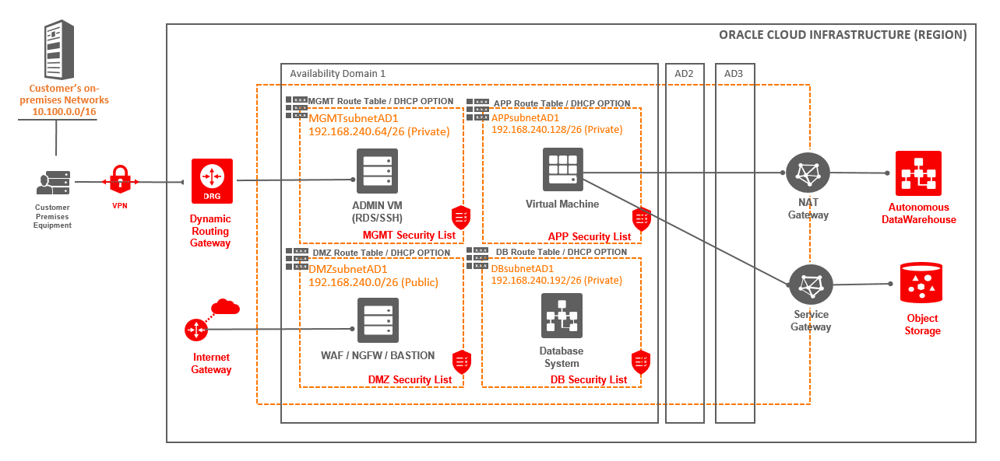{width="9.991779308836396in"
height="4.614583333333333in"}

**Use full Links**

[Learn more about IaC and
Terraform](file:///C:\confluence\display\ECSP\IaC+and+Terraform)

How to use the Terraform recipe
-------------------------------

The commands in this guide based on Windows machine. There are some
requirements that you need to fulfil before you start.

### Requirements

You will need to have Terraform install to be able to execute the
Terraform files. Access to tenant with a use that is member of the
Administrator group. The user need have API key in place. A compartment
is need to host the services.

**Terraform**\
You need Terraform installed on your machine.\
If don't have it then follow this guide -
<https://www.terraform.io/intro/getting-started/install.html>

**User\
**User with the right access and a API Key will be generated doing the
this guide

**Information needed**\
Please be sure that you have collected below information before you
start executing. If you do not all the need information, then execution
will fail.\
**tenancy\_ocid:** ex. 
\"ocid1.tenancy.oc1..aaaaaaaa3pi2x5yqidqenk4ybimduwxvmlwcuxuetz7k3iuini4jjlmmy36q\"\
**user\_ocid:** ex.
\"ocid1.user.oc1..aaaaaaaa7ael4fy6ox4zmjyjqvy5qb4sv5wfmkicr4no3yundyk7w57k5x7a\"\
**region:** ex. \"uk-london-1\" or \"eu-frankfurt-1\"

Get started
-----------

Now that the requirements are fulfil.

1.  Download the zip file that has all the need files for deployment.
    From: [Release](file:///C:\confluence\display\ECSP\Release) 

2.  Create a new folder fx.  C:\\customer\\sandbox\_awd\_atp\_a

3.  Extract the zip into this new folder.\
    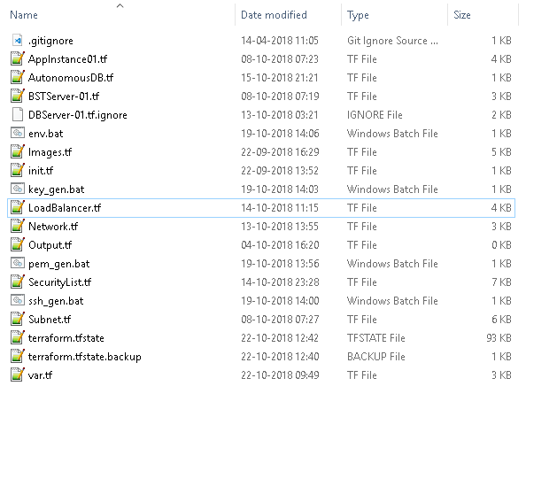{width="4.875in"
    height="4.322916666666667in"}

4.  Open Windows Command Prompt (Window key + r \> Run cmd.exe)\
    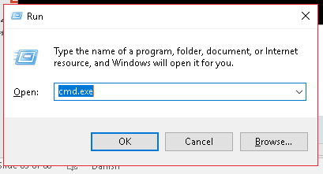{width="4.260416666666667in"
    height="2.3020833333333335in"}

5.  Add the API key to OCI user that is part of the Administrator group
    on OCI

6.  Go to Users in the OCI console. Menu \> Identity \> Users\
    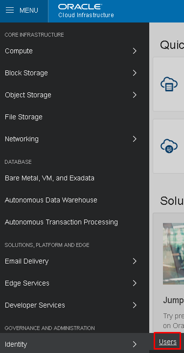{width="3.9166666666666665in"
    height="7.520833333333333in"}

7.  Create a new user, Create User\
    {width="1.6041666666666667in"
    height="1.4166666666666667in"}

8.  Provide a name and description for the new user\
    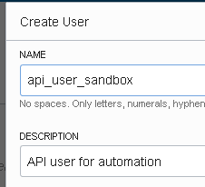{width="2.3541666666666665in"
    height="2.1458333333333335in"}

9.  Open the user, press the name\
    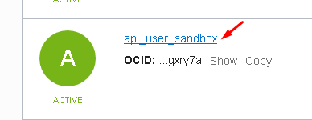{width="4.041666666666667in"
    height="1.5625in"}

10. Add a new API key; press Add Public Key\
    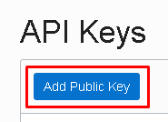{width="1.9270833333333333in"
    height="1.3958333333333333in"}

11. Past the public key content into the window.  You can get the
    content my run this command in the open command prompt; notepad
    ./.oci/oci\_api\_key\_public.pem\
    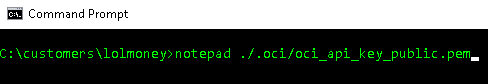{width="4.875in"
    height="0.8333333333333334in"}\
    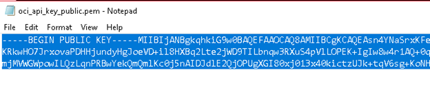{width="4.875in"
    height="1.0in"}\
    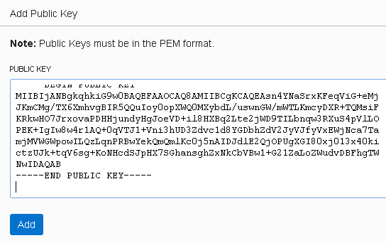{width="4.875in"
    height="3.0625in"}

12. Add the user to the Administrator group. Press Identity \> Groups \>
    Administartors\> Add User to Group \> Select the user from the
    drop-down\
    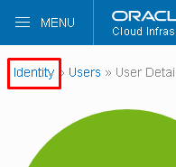{width="2.03125in"
    height="1.9270833333333333in"}\
    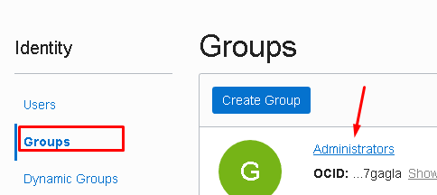{width="4.875in"
    height="2.1666666666666665in"}\
    {width="2.1875in"
    height="1.25in"}\
    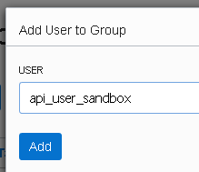{width="2.28125in"
    height="1.9583333333333333in"}

13. Now the next step to execute the Terraform setup

14. Go back to the Command Prompt

15. Run 'Terraform init'\
    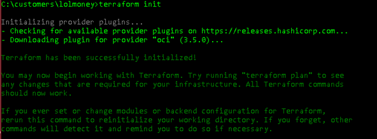{width="4.875in"
    height="1.7916666666666667in"}

16. Now Run 'Terraform plan' and provide the needed information doing
    the execution.\
    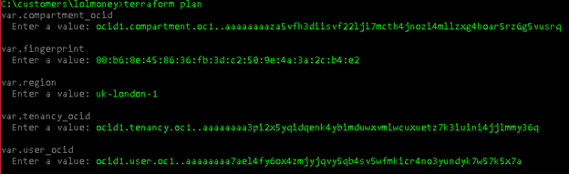{width="4.875in"
    height="1.4895833333333333in"}

17. Run 'Terraform applies' and provide the needed information doing the
    execution.\
    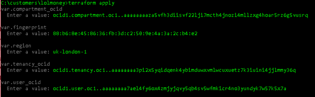{width="4.875in"
    height="1.5in"}

18. Please confirm it by type 'yes'\
    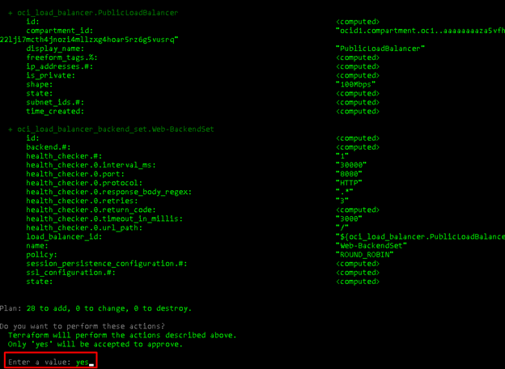{width="4.875in"
    height="3.5625in"}

19. Terraform will now apply the configuration to OCI\
    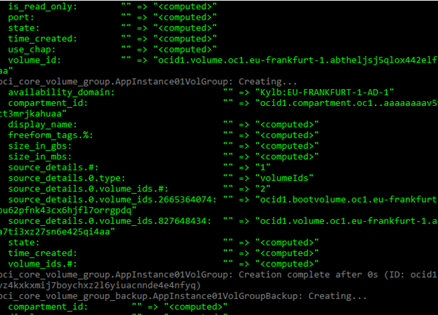{width="4.875in"
    height="3.5in"}

20. In the end, you will get the output listed on the screen\
    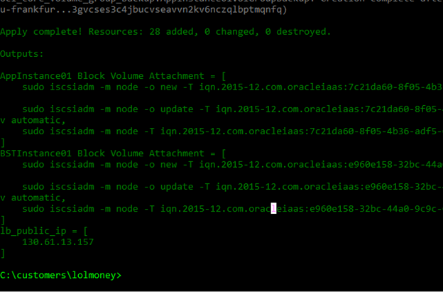{width="4.875in"
    height="3.2083333333333335in"}

21. Now the deployment is done, and you can go the OCI console to check
    how it looks\
    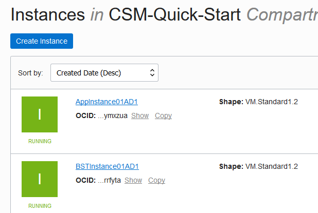{width="4.875in"
    height="3.2708333333333335in"}\
    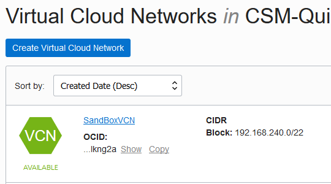{width="4.875in"
    height="2.7083333333333335in"}\
    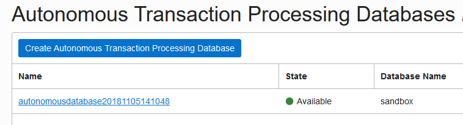{width="4.875in"
    height="1.3125in"}
